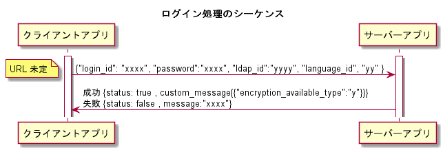

# ログイン方法について

## 初めに

ログインID/PWを利用して認証処理を行う
本ファイルでは、接続先サーバーに関しては言及しない

## ログイン処理手順

1. クライアント側、サーバーに対して（ログインID/ログインPW/LDAP_ID/言語ID※）を送る
2. サーバー側、1．で記載されたデータを受け取る
3. サーバー側、受信したデータをもとにLDAPor通常のログイン処理を行う
4. サーバー側、ログインの判定結果をクライアント側に送る
5. クライアント側、取得した結果をもとに画面の描画を行う

> 将来的に多言語機能の実装を見越して言語IDを送付する。
> 初期リリース段階では01固定で通信を行う

### ログイン処理のシーケンス図

